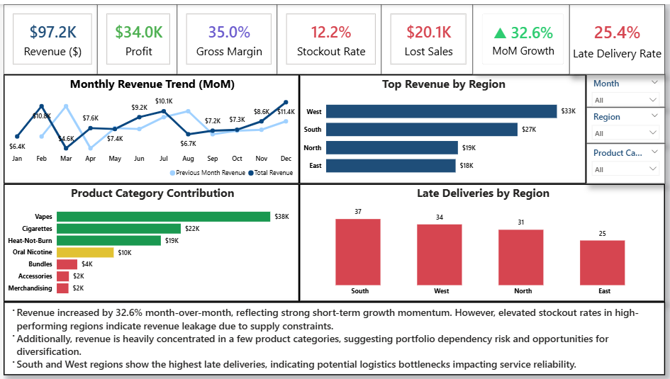

# 📊 Operational Intelligence & Performance Dashboard

## 🚀 Overview
This project delivers an end-to-end Business Intelligence identifying **Revenue Leakage, Delivery Risks, and Operational Bottlenecks, Analyzing operational efficiency, logistics performance, revenue trends, and business KPIs using Power BI.**.  

The dashboard integrates sales, inventory, and logistics data to provide actionable insights for decision-makers and highlight opportunities to improve revenue and operational performance.



---

## ❗ Business Problem

Organizations often struggle to connect:
- Sales performance
- Logistics operations
- Inventory risks
- Delivery efficiency
- Revenue impact

As a result:
- stockouts increase
- late deliveries rise
- revenue leakage occurs
- operational inefficiencies go undetected

This project was designed to provide a centralized operational intelligence system for monitoring business performance and identifying operational risks before they impact revenue.

---

## 📈 Executive Insights

- 🚚 Late deliveries negatively impacted fulfillment efficiency
- 📉 Stock availability gaps increased operational risk exposure
- 💰 Revenue concentration identified among top-performing categories
- ⚠️ Logistics delays correlated with declining operational performance
- 📦 Inventory inefficiencies contributed to fulfillment bottlenecks

---

## ❓ Business Questions Answered

- Which products and regions generate the highest revenue?
- Where are logistics delays impacting operational efficiency?
- Which operational risks threaten revenue performance?
- How do delivery issues affect fulfillment KPIs?
- Which inventory gaps create stockout risks?
- What operational areas require optimization?

---

## 📂 Repository Structure

```text
├── dashboard/
│   ├── operations_dashboard.png
├── data/
│   └── operational_intellingence_dataset.xlsx
├── Operatons_Intellingence_Dashboard.pbix
└── README.md
```

---

## 🗂️ Dataset Overview

```
The dataset contains operational and sales-related records including:

| Table / Data Area | Description |
|---|---|
| Sales Data | Revenue, orders, product performance |
| Logistics Data | Delivery timelines, fulfillment metrics |
| Inventory Data | Stock levels, availability, shortages |
| Operational KPIs | Risk indicators and performance metrics |
```

---

## 🔄 Analytics Workflow

```text
Raw Operational Data
        ↓
Power Query ETL & Cleaning
        ↓
Data Modeling & Relationships
        ↓
DAX KPI Calculations
        ↓
Interactive Power BI Dashboards
        ↓
Operational & Revenue Insights
```
---


## 📊 Dashboard Overview

This dashboard integrates:
- Sales performance monitoring
- Logistics operational tracking
- Revenue analysis
- Operational risk visibility
- KPI reporting

into a centralized business intelligence solution.

---

## 📊 Dashboard Walkthrough

### Executive Operations Dashboard

Tracks:
- Revenue performance
- Order fulfillment
- Logistics KPIs
- Operational efficiency
- Inventory & delivery performance
- Risk indicators

Key focus:
- centralized operational visibility
- business performance monitoring
- operational decision support

---

## 🖼️ Dashboard Preview


---
## 🔍 Key Insights

### 🚚 Logistics Delays Impact Fulfillment Efficiency
Late deliveries and shipping delays reduced operational performance and increased fulfillment risk exposure.

---

### 📉 Inventory Gaps Increase Revenue Risk
Stock shortages and inventory inconsistencies created fulfillment bottlenecks and potential revenue leakage.

---

### 💰 Revenue Concentration Identified
A small group of products/categories contributed disproportionately to total revenue generation.

---

### ⚠️ Operational Risks Are Interconnected
Sales performance, logistics efficiency, and inventory availability were strongly connected across operational workflows.

---

### 📦 Operational Visibility Improves Decision-Making
Centralized KPI monitoring improves the ability to detect operational issues before they escalate.

---

## 💼 Business Impact

This solution enables organizations to:

- 📊 Monitor operational KPIs in real time
- 🚚 Reduce logistics inefficiencies
- 📉 Minimize stockout risks
- 💰 Improve revenue visibility
- ⚠️ Identify operational bottlenecks early
- 📦 Support data-driven operational planning

---

## 💡 Recommendations
- Optimize inventory allocation in high-demand regions  
- Improve supply chain processes to reduce stockouts  
- Address logistics bottlenecks in high-delay regions  
- Diversify product portfolio to reduce dependency risk  

---

## 🧰 Tools & Technologies

- Power BI → Dashboard development
- Power Query → ETL & data cleaning
- DAX → KPI calculations & business logic
- Excel / CSV → Data source
- GitHub → Version control & project documentation

---

## 🚀 Future Improvements

- Add predictive delivery risk modeling
- Implement inventory forecasting
- Build supplier performance analysis
- Add anomaly detection for operational risks
- Deploy dashboard to Power BI Service

---

## 🧾 Final Takeaway

> Operational inefficiencies are not isolated problems.

> Sales performance, logistics execution, inventory availability, and fulfillment efficiency are deeply connected — and organizations that monitor them together gain stronger operational visibility and faster decision-making capabilities.

---

## 🔗 Author

**Richard A Oketade**  

Data Analyst | Business Intelligence | Marketing & Operations Analytics  

🔗 LinkedIn: https://www.linkedin.com/in/abodunrin-oketade
